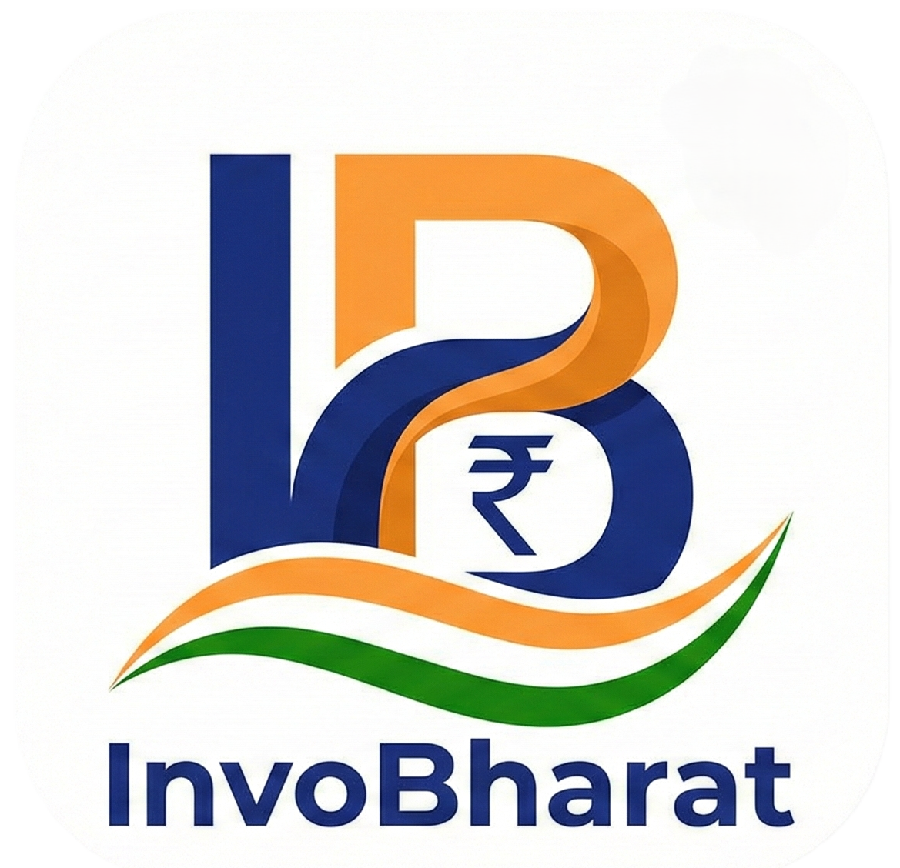

<div align="center">
  

  # InvoBharat 🇮🇳

  [](https://github.com/SV-stark/InvoBharat/actions/workflows/windows_build.yml)
  
  
</div>

**InvoBharat** is a fast, offline-first invoice generator tailored for the Indian market, now optimized for **Windows** with a beautiful **Fluent UI**. It empowers freelancers and small businesses to create professional, GST-compliant invoices in seconds—customized to their needs and ready to share as PDFs.

---

## 🚀 Key Features

### 📊 Professional Dashboard and Analytics
- **Real-time Stats**: Track Total Revenue and Total Invoices generated at a glance.
- **GST Liability Breakdown**: View detailed **CGST**, **SGST**, and **IGST** liabilities.
- **Smart Filtering**: Analyze data by **All Time**, **This Month**, **Last Month**, or **Financial Quarters** (Q1-Q4).
- **Interactive Graphs**: Visual representation of your business growth (Coming Soon).

### 🧾 Powerful Invoicing
- **GST Compliant**: Automated tax calculations specialized for Indian billing standards.
- **Auto-Suggest**: Smart **Place of Supply** selection with all Indian States and UTs.
- **Full Screen Preview**: Interactive PDF preview with Zoom, Scroll, and Print capabilities before saving.
- **Item Management**: Easy addition of items with SAC/HSN codes and distinct GST rates.

### 🎨 Customization at its Core
- **Brand Identity**: Upload your **Business Logo** to appear on invoices.
- **Theme Support**: Choose from **Light** or **Dark** modes to suit your preference.
- **Accent Colors**: Personalize the app with your brand color (Teal, Blue, Red, Video, etc.).
- **Currency Support**: Global support for major currencies (₹, $, €, £, ¥).

### 📄 Professional PDF Generation
- **Multiple Templates**: Choose from **Modern**, **Professional**, and **Minimal** designs.
- **Unicode Support**: Full support for Indian Rupee (`₹`) and other currency symbols.
- **Dynamic Content**: Auto-converts numbers to words (e.g., "Rupees One Hundred Only").

---

## 📥 Download

Get the latest nightly build for **Windows**:

[](https://github.com/SV-stark/InvoBharat/releases/tag/nightly)

> **Note**: This is a nightly release. It contains the absolute latest features but may be experimental.

---

## 🛠️ Tech Stack

- **Framework**: [Flutter](https://flutter.dev) (Dart)
- **UI Library**: [fluent_ui](https://pub.dev/packages/fluent_ui) (Windows Native Feel)
- **State Management**: [Riverpod](https://riverpod.dev)
- **PDF Engine**: `pdf` & `printing` packages
- **Typography**: Google Fonts (Noto Sans)

## 👨‍💻 Development Setup

To build InvoBharat locally, ensure you have the [Flutter SDK](https://docs.flutter.dev/get-started/install) installed.

1.  **Clone the repository**
    ```bash
    git clone https://github.com/SV-stark/InvoBharat.git
    cd InvoBharat
    ```

2.  **Install dependencies**
    ```bash
    flutter pub get
    ```

3.  **Run the app**
    ```bash
    # For Windows
    flutter run -d windows
    ```

4.  **Run Tests**
    ```bash
    flutter test
    ```

## 🤝 Contributing

Contributions are welcome! If you find a bug or have a feature request, please [open an issue](https://github.com/SV-stark/InvoBharat/issues).

1.  Fork the Project
2.  Create your Feature Branch (`git checkout -b feature/AmazingFeature`)
3.  Commit your Changes (`git commit -m 'Add some AmazingFeature'`)
4.  Push to the Branch (`git push origin feature/AmazingFeature`)
5.  Open a Pull Request

## 📄 License

This project is licensed under the **MIT License** - see the [LICENSE](LICENSE) file for details.

---

<div align="center">
 Made with ❤️ in India.
</div> 