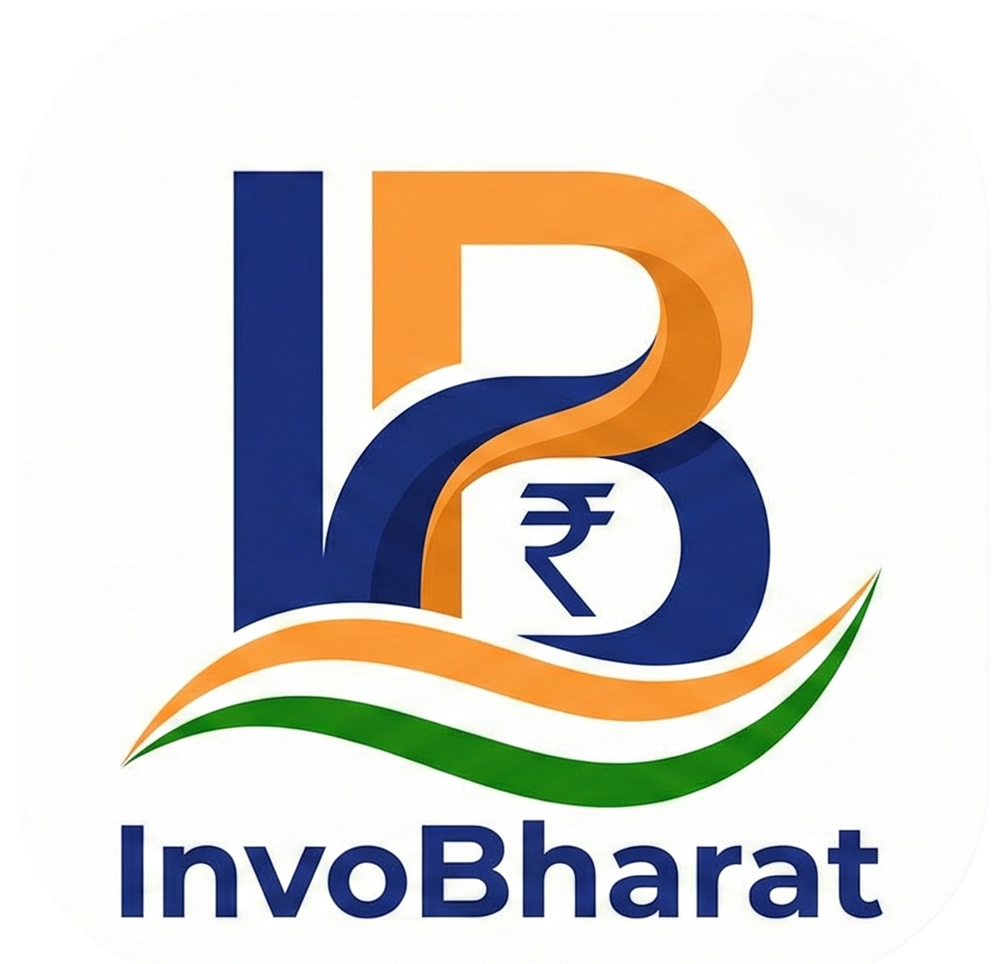

<div align="center">
  
  
  # InvoBharat 🇮🇳
  
  **The Professional, Offline-First Invoice Generator for India**
  
  [](https://github.com/SV-stark/InvoBharat/actions/workflows/windows_build.yml)
  [](https://github.com/SV-stark/InvoBharat/actions/workflows/linux_build.yml)
  
  

  _Empowering freelancers and small businesses with instant, GST-compliant invoicing._

  [**Download for Windows**](https://github.com/SV-stark/InvoBharat/releases/latest) • [**Download for Linux**](https://github.com/SV-stark/InvoBharat/releases/latest) • [**Report Bug**](https://github.com/SV-stark/InvoBharat/issues)
</div>

---

## 🚀 Overview

**InvoBharat** bridges the gap between complex accounting software and manual billing. Designed specifically for the Indian market, it combines successful design patterns from modern OS ecosystems—**Fluent UI** for Windows & Linux and **Material 3** for Android—to provide a native, seamless experience.

Generates beautiful, professional PDFs in seconds. No internet required. No subscription fees. Just pure productivity.

## ✨ Key Features

| Feature | Description |
| :--- | :--- |
| **📊 Smart Dashboard** | Real-time analytics for **Revenue**, **Invoices**, and **Tax Liability** (CGST/SGST/IGST). Filter by financial quarter or month. |
| **🧾 Instant Invoicing** | Auto-calculation of taxes and totals. Smart detection of **Inter-state vs Intra-state** supply based on GSTIN. |
| **📋 Estimates & Quotes** | Create professional estimates and convert them to invoices with one click. |
| **🔄 Recurring Invoices** | Set up profiles for auto-generating invoices for repeat clients. |
| **🎨 Native Experience** | **Desktop**: Fluent UI experience. **Android**: Dynamic Material You theming. Dark mode support on all platforms. |
| **📁 Client Management** | Save client details once (GSTIN, Address) and auto-fill them forever. **View Client Ledger** for transaction history. |
| **📦 Product Library** | Manage products/services with predefined tax slabs. **HSN/SAC Lookup** with auto-fill for 100+ common codes. |
| **📉 Aging Reports** | Visual breakdown of **Receivables** (Overdue Invoices) by aging buckets (30/60/90 days). |
| **💾 Secure Backups** | Full **Database Backup (ZIP)** and restore functionality to keep your data pixel-perfect. |
| **🇮🇳 India Ready** | **Number-to-Words** conversion (e.g., "Rupees One Thousand Only"). **GSTR-1 & GSTR-3B** compatible CSV exports for easy filing. |
| **📝 Audit Logs** | Track all changes to invoices and profiles for better financial accountability and compliance. |
| **🖨️ Professional Output** | High-resolution A4 PDFs with your brand logo. Full-screen print preview and layout customization. |

---

## 📁 Project Structure

InvoBharat follows a clean, feature-organized structure:

- **`lib/data`**: Sqlite repository implementations and Drift database definitions.
- **`lib/models`**: Domain models (Freezed) for Invoices, Clients, Profiles, etc.
- **`lib/providers`**: Riverpod state management and business logic.
- **`lib/screens`**: UI screens and page layouts.
- **`lib/services`**: External integrations (PDF, GSTR, Email, Backup).
- **`lib/utils`**: Formatting utilities, validators, and helper constants.
- **`lib/widgets`**: Reusable UI components and shared widgets.

---

## ❓ Troubleshooting

### Blank/Gray Screen on Startup (Windows)
If the app shows a blank gray screen, you are likely missing the **Visual C++ Redistributable**.
1. [Download VC++ Redistributable (x64)](https://aka.ms/vs/17/release/vc_redist.x64.exe)
2. Install and Restart.

---

## 📥 Download & Install

###  Windows Users
Download the latest `.exe` installer or portable zip from our [Releases Page](https://github.com/SV-stark/InvoBharat/releases/latest).

###  Linux Users
We provide an **AppImage** that runs on most Linux distributions (Ubuntu, Fedora, Arch, etc.).
1. Download the `InvoBharat-Linux.AppImage`.
2. Right-click > Properties > Allow executing file as program.
3. Double-click to run!

---

## 🛠️ Built With

InvoBharat is built using **Flutter**, leveraging the power of Dart for high-performance, cross-platform execution.

- **Core**: [Flutter](https://flutter.dev) & Dart
- **State Management**: [Riverpod](https://riverpod.dev)
- **UI Toolkit**:
    - [fluent_ui](https://pub.dev/packages/fluent_ui) (Windows & Linux)
    - Material Design 3 (Android)
- **PDF Generation**: `pdf` & `printing`
- **Data Persistence**: `sqlite3` & `drift` (High Performance & ACID Compliant)

---

## 👨‍💻 Local Development

### Prerequisites
- [Flutter SDK](https://docs.flutter.dev/get-started/install) (3.0.0+)
- **Linux**: `clang`, `cmake`, `ninja-build`, `pkg-config`, `libgtk-3-dev`, `liblzma-dev`, `libsecret-1-dev`, `libjsoncpp-dev`
- **Windows**: Visual Studio 2022 (C++ Desktop Development workload)

### Steps

```bash
# 1. Clone the repository
git clone https://github.com/SV-stark/InvoBharat.git
cd InvoBharat

# 2. Install dependencies
flutter pub get

# 3. Generate required code (freezed, drift, json_serializable)
dart run build_runner build --delete-conflicting-outputs

# 4. Run the app
flutter run -d windows # or linux
```

---

## 🤝 Contributing

We welcome contributions! Whether it's fixing bugs, improving documentation, or proposing new features.

1. Fork the Project
2. Create your Feature Branch (`git checkout -b feature/AmazingFeature`)
3. Ensure your code passes all checks:
   ```bash
   flutter analyze
   flutter test
   ```
4. Commit your Changes (`git commit -m 'Add some AmazingFeature'`)
5. Push to the Branch (`git push origin feature/AmazingFeature`)
6. Open a Pull Request

## 📄 License

Distributed under the **GNU Affero General Public License v3 (AGPLv3)**. See `LICENSE` for more information.

<div align="center">
  <sub>Made with ❤️ in India by <a href="https://github.com/SV-stark">SV-stark</a></sub>
</div>